# Initial network setup

### Introduction

Estimated Time: 60 minutes

### About the ODB Network

An ODB network is a private and isolated network that hosts the Oracle Exadata VM Clusters and Autonomous VM Clusters within a specified AWS Availability Zone (AZ). The ODB network consists of a CIDR range of IP addresses. The ODB network maps directly to the network that exists within the Oracle Cloud Infrastructure (OCI) child site, thus serving as the means of communication between AWS and OCI. In Oracle Multicloud architecture, the ODB network is designed to accommodate and provide network connectivity for the OCI components that are part of Oracle Database@AWS.

The ODB network is a private network, and by default, doesn't have connectivity to AWS VPCs, on-premises networks or the internet. ODB peering is a user-created network connection that enables traffic to be routed privately between an Amazon VPC and an ODB network.

### Objectives

In this lab, you will:

* Create an ODB Network in an AWS Availability Zone.
* Create a VPC in the same Av. Zone as the ODB Network.
* Create a peering between the ODB Network and the AWS VPC.


## Task 1: Create the ODB Network.

We will start with a basic VCN deployment. One of the goals of this livelab is also to provide an understanding of OCI routing and gateways, in relation to the OCI Network Firewall service. For this reason, we will not use the VCN Wizard which deploys all OCI Gateways and creates basic routing rules. Instead, we will manually create each artifact as needed.

1. Log into the AWS Cloud console and select the region in which you want to deploy the service. In the **search** bar find **Oracle Database@AWS** and click on it. You will be directed to the service's home page.
  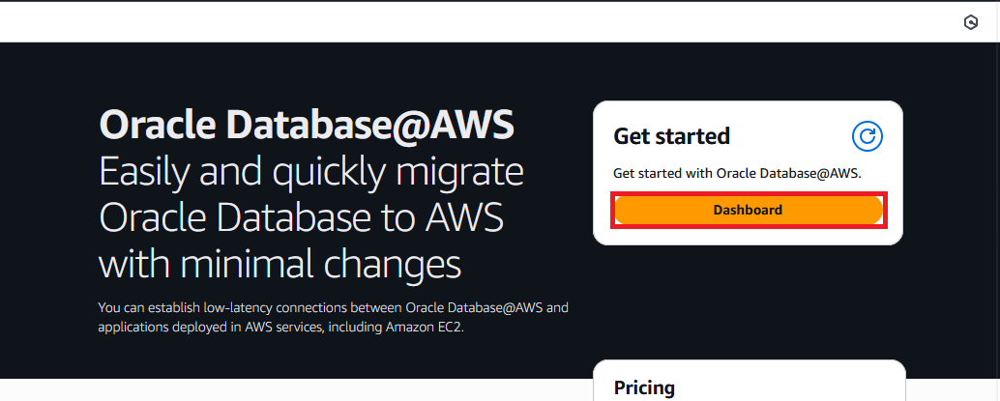

Click on **Dashboard** to get access to the Service.

2. In the Service's menu, select **ODB Networks** on the left and click **Create ODB Network** on the right.
  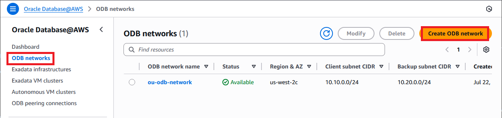
  
3. In the create menu, input the following:

* the ODB Network name.
* select the Availability Zone. Note: The the AZ drop-down menu you will only see the AWS Zones where the service is available, within the selected region. I will use **us-west-2c** for this lab.
* Client subnet CIDR: input an IP CIDR range which will be used by the service for deploying the database interfaces to which you will connect your applications. This has to be a non-overlapping, routable CIDR from your network.
* Backup subnet CIDR: input an IP CIDR range which will be used by the service for deploying the database interfaces which will be used for the backup service. This has to be a non-overlapping CIDR from your network. 
    * Note that the **Client CIDR** and the **Backup CIDR** have to be part of the same RFC1918 space (ex: 10/8). 
* DNS Configuration: input a private DNS Zone in which the database will be deployed. There are 2 options:
    * Default: Oracle will generate a private DNS Zone ending with **oraclevcn.com**. We will use this option for this deployment.
    * Custom domain name: you can deploy the databases in any private zone that you want.
* Leave all other setting on **default** and press Create.
  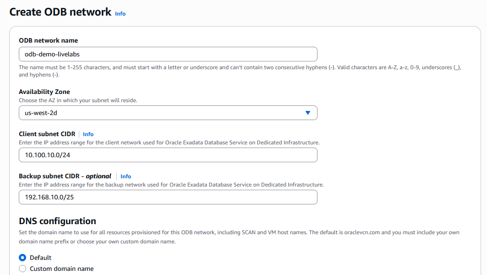

Note: it can take up to 1 hour for the ODB Network deployment to complete. You can continue with the next task while the process is ongoing.

## Task 2: Create the AWS VPC

  The ODB Network must be peered to an AWS VPC for any connectivity to be available. We will deploy a VPC, called TransitVPC, which will act as a connection point between the AWS Transit Gateway (deployed in the next lab) and the ODB Network. 

1. In the AWS Console, search for the VPC menu and press **Create VPC**. 
  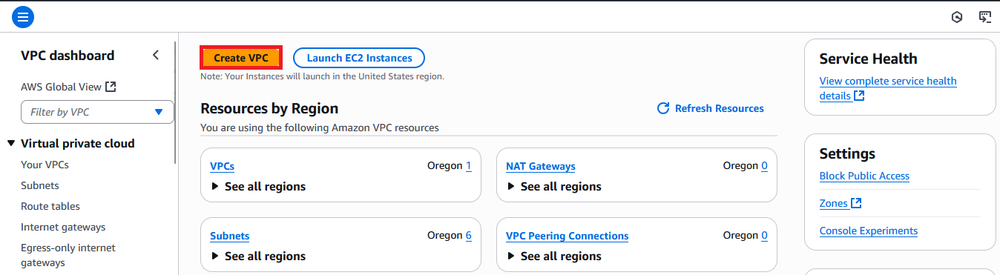

   In the menu that opens, give the VPC a name and an IPv4 CIDR. I will name it **TransitVPC** and give it the 172.16.0.0/24 CIDR.
  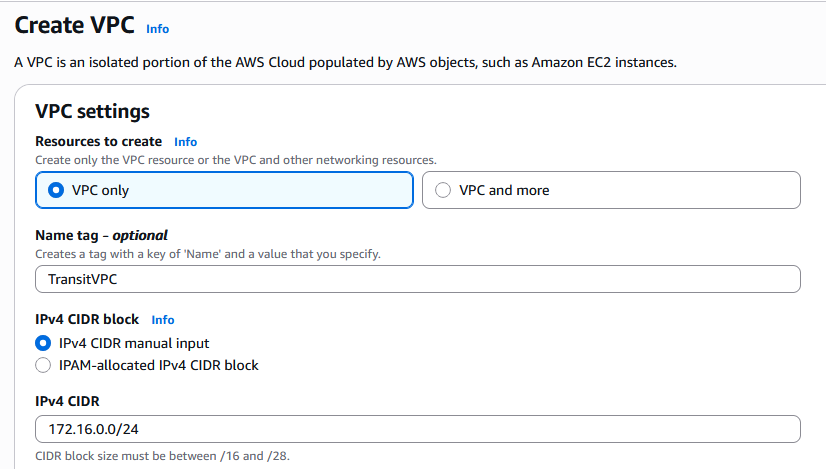

2. On the AWS VPC Details page, on the left menu, click **Subnets** on the left and then click on **Create subnet** on the right.
  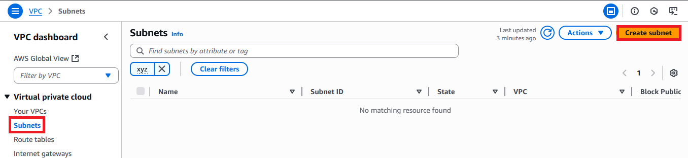

   In the menu that opens, input the following details:
* choose the previously deployed VPC - **TransitVPC**.
* give it a name - I will name it **transit_subnet**.
* choose the AWS Availability Zone **identical** to the previously created ODB Network, which will be **us-west-2c** for my deployment. Note that choosing a different AZ will make all further network flows fail so the subsequent LABs in this Live-LAB will not work.
* Choose a CIDR block from the available VPC range. I will choose **172.16.0.0/27**.
  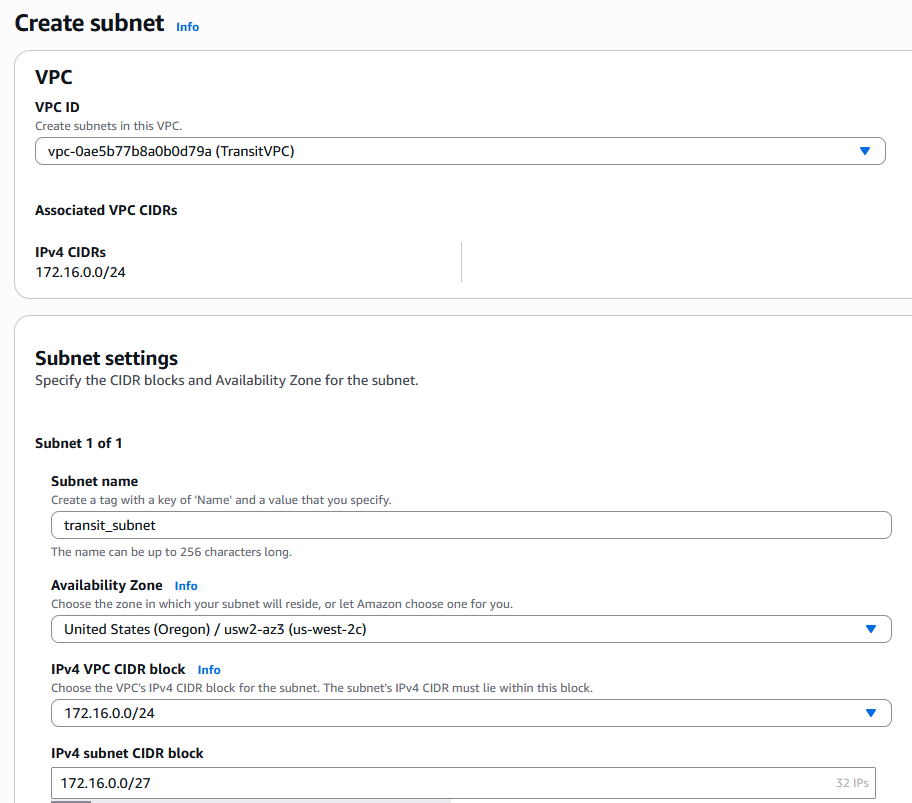

## Task 3: Create the ODB Peering

  Now that we have the ODB and the VPC, we need to peer them together so network flows are available.

1. In the Oracle Database@AWS menu, select **ODB Networks** on the left and make sure the status of the previously created ODB Network is **Available**. If it is not, do not move forward and try to fix the deployment by redeploying the ODB Network. 
  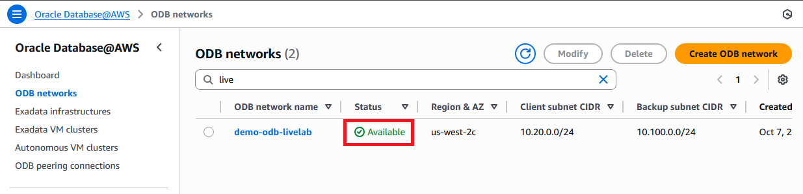

2. In the Oracle Database@AWS menu, select **ODB peering connections** on the left and click **Create ODB peering connection** on the right.
  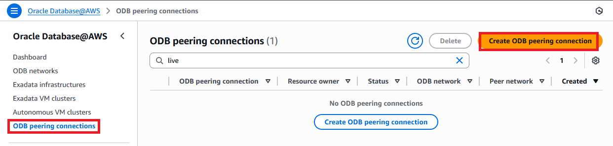

   In the menu that opens, give the connection a name, select the deployed ODB Network and the TransitVPC (by VPC ID) and press Create.
  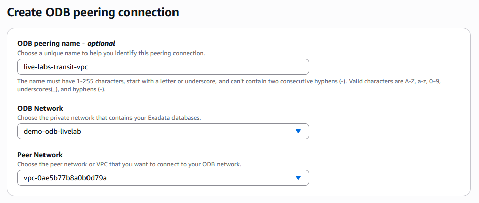

   Wait for the peering status to become **Available** before moving on to the next step.

 3. Once the Peering is **Available**, click on the ODB Network name to get the details of the ODB, needed for the next step.
  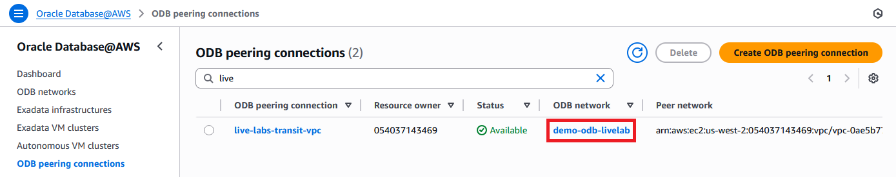

    In the menu that opens, note the following details:
    * Client subnet CIDR range - for me this will be **10.20.0.0/24**.
    * ODB network ARN - for me this will be **arn:aws:odb:us-west-2:054037143469:odb-network/odbnet_uen4l49j7p**.

  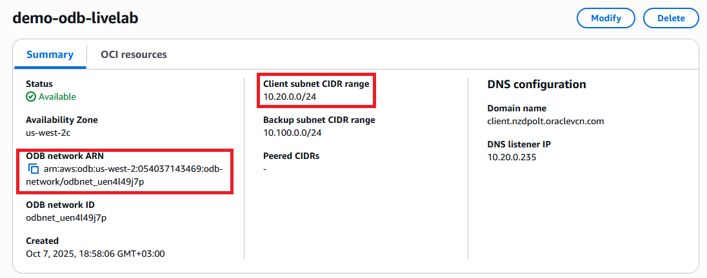

4. Next, go to the VPC details page and select the Transit VPC. In the TransitVPC, select the Resource Map and note which VPC Route table controls the transit subnet. For me, its **rtb-0da24ddbce3bdab1e**.
  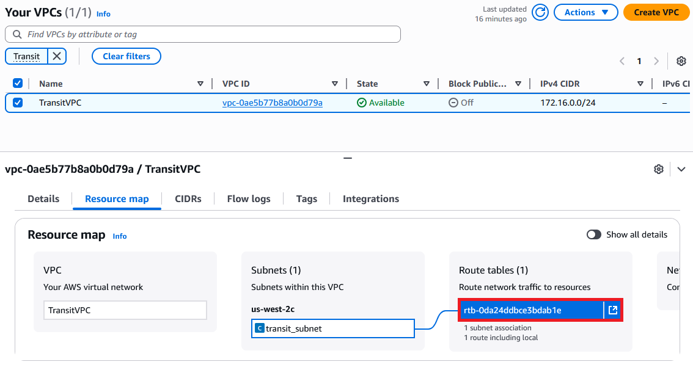

  Next, we need to create a route in the VPC route table using AWS CLI. Starting from the [documentation](https://docs.aws.amazon.com/odb/latest/UserGuide/configuring.html), we need to build the route in the specific format. You will need the VPC route table ID, the client subnet CIDR and the ODB ARN, captured in the previous steps. Create the command as below, replacing my values with your own values:

   ```
    aws ec2 create-route \
    --route-table-id rtb-0da24ddbce3bdab1e \
    --destination-cidr-block 10.20.0.0/24 \
    --odb-network-arn arn:aws:odb:us-west-2:054037143469:odb-network/odbnet_uen4l49j7p
    ```    

  Next, open AWS CloudShell and issue the command. You should see **"Return": true** as an output.

  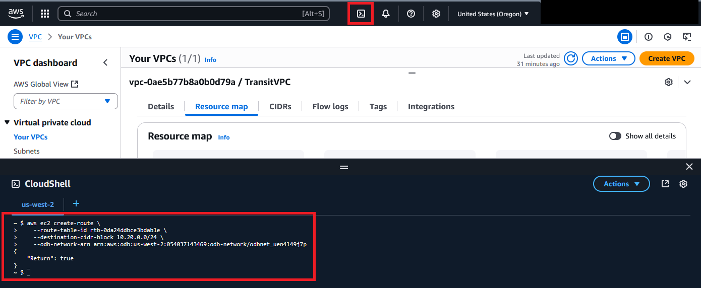

  Confirm the new route is now visible in the Route table details, under the VPC menu.

  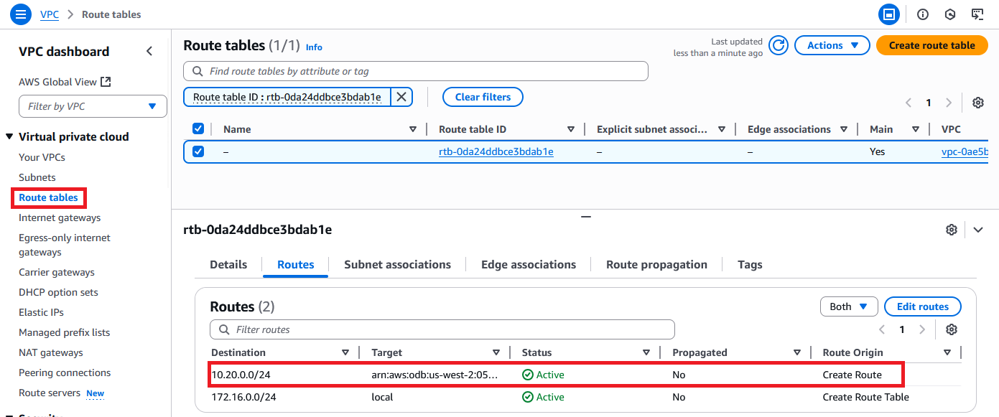


**Congratulations!** You have successfully completed this lab. You may now **proceed to the next lab**.

## Acknowledgements

* **Author** - Radu Nistor, Master Principal Cloud Architect, OCI Networking
* **Last Updated By/Date** - Radu Nistor, November 2025
