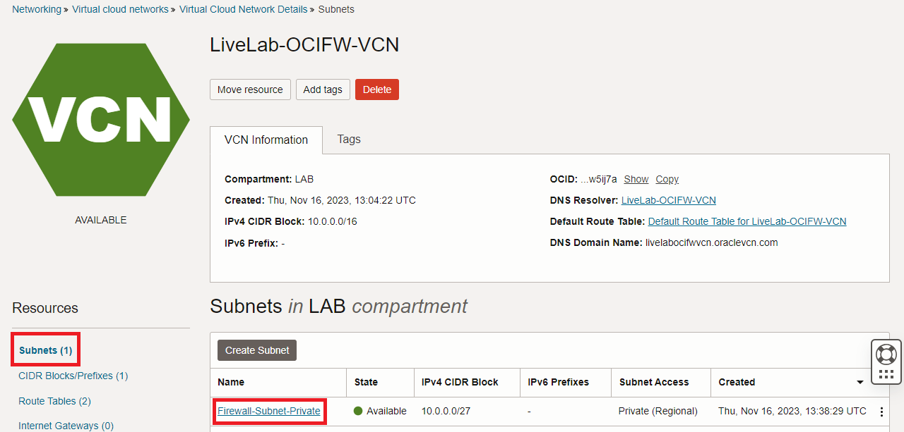
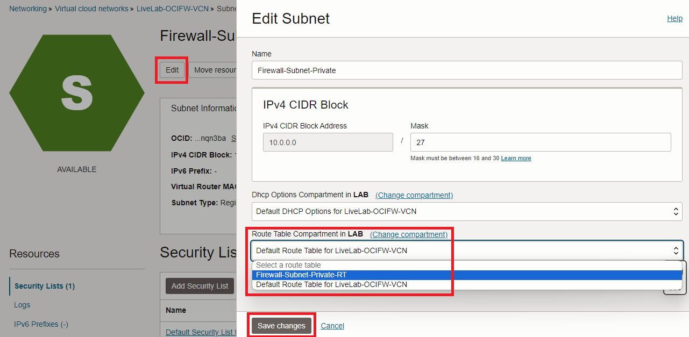
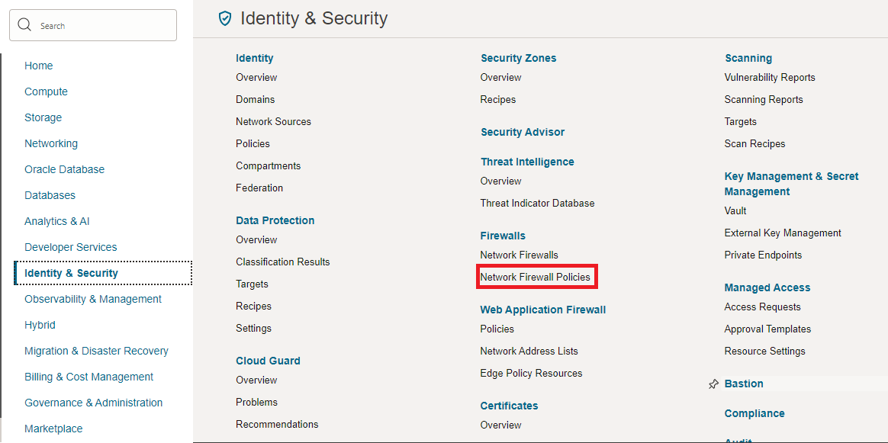
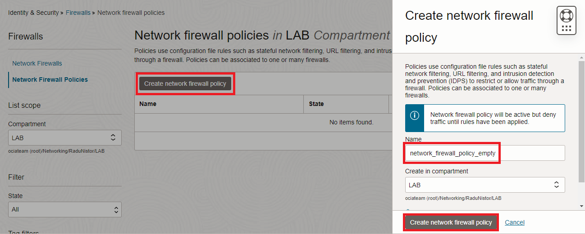
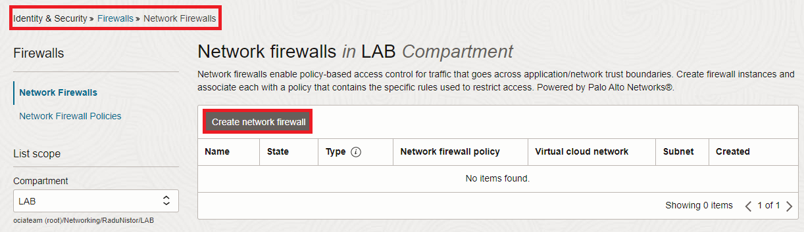
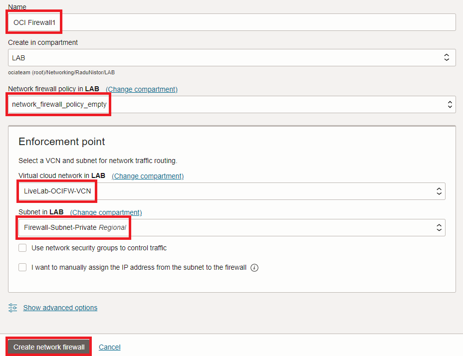
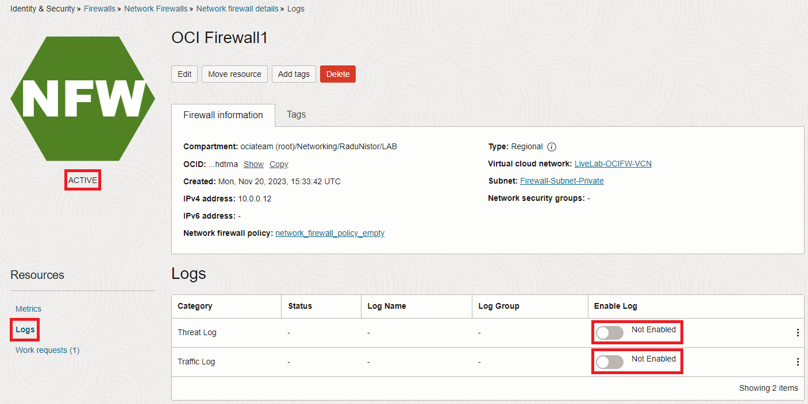

# Initial network setup

### Introduction

Estimated Time: 60 minutes

### About the ODB Network

An ODB network is a private and isolated network that hosts the Oracle Exadata VM Clusters and Autonomous VM Clusters within a specified AWS Availability Zone (AZ). The ODB network consists of a CIDR range of IP addresses. The ODB network maps directly to the network that exists within the Oracle Cloud Infrastructure (OCI) child site, thus serving as the means of communication between AWS and OCI. In Oracle Multicloud architecture, the ODB network is designed to accommodate and provide network connectivity for the OCI components that are part of Oracle Database@AWS.

The ODB network is a private network, and by default, doesn't have connectivity to AWS VPCs, on-premises networks or the internet. ODB peering is a user-created network connection that enables traffic to be routed privately between an Amazon VPC and an ODB network.

### Objectives

In this lab, you will:

* Create an ODB Network in an AWS Availability Zone.
* Create a VPC in the same Av. Zone as the ODB Network.
* Create a peering between the ODB Network and the AWS VPC.

## Task 1: Create the ODB Network.

We will start with a basic VCN deployment. One of the goals of this livelab is also to provide an understanding of OCI routing and gateways, in relation to the OCI Network Firewall service. For this reason, we will not use the VCN Wizard which deploys all OCI Gateways and creates basic routing rules. Instead, we will manually create each artifact as needed.

1. Log into the AWS Cloud console and select the region in which you want to deploy the service. In the **search** bar find **Oracle Database@AWS** and click on it. You will be directed to the service's home page.
  

Click on **Dashboard** to get access to the Service.

2. In the Service's menu, select **ODB Networks** on the left and click **Create ODB Network** on the right.
  
  
3. In the create menu, input the following:

* the ODB Network name.
* select the Availability Zone. Note: The the AZ drop-down menu you will only see the AWS Zones where the service is available, within the selected region. I will use **us-west-2c** for this lab.
* Client subnet CIDR: input an IP CIDR range which will be used by the service for deploying the database interfaces to which you will connect your applications. This has to be a non-overlapping, routable CIDR from your network.
* Backup subnet CIDR: input an IP CIDR range which will be used by the service for deploying the database interfaces which will be used for the backup service. This has to be a non-overlapping CIDR from your network. 
    * Note that the **Client CIDR** and the **Backup CIDR** have to be part of the same RFC1918 space (ex: 10/8). 
* DNS Configuration: input a private DNS Zone in which the database will be deployed. There are 2 options:
    * Default: Oracle will generate a private DNS Zone ending with **oraclevcn.com**. We will use this option for this deployment.
    * Custom domain name: you can deploy the databases in any private zone that you want.
* Leave all other setting on **default** and press Create.
  

Note: it can take up to 1 hour for the ODB Network deployment to complete. You can continue with the next task while the process is ongoing.

## Task 2: Create the AWS VPC

  The ODB Network must be peered to an AWS VPC for any connectivitty to be available. We will deploy a VPC which will act as a connection point between the AWS Transit Gateway (deployed in the next lab) and the ODB Network. 

1. In the AWS Console, search for the VPC menu and press **Create VPC**. 
  

   In the menu that opens, give the VPC a name and an IPv4 CIDR. I will name it **TransitVPC**.
  

2. On the VCN Details page, on the left menu, click **Subnets** and then click on the Firewall subnet created earlier.
  

   In the menu that opens (subnet details), click **Edit**. In the new menu, replace the default Route Table with the one previously created and save the changes.
  

## Task 3: Create the ODB Peering

  Now that we prepared the VCN and the Subnet, it is time to focus on the OCI Network Firewall. To deploy a Firewall we need to give it a policy. We will start by deploying an empty Firewall Policy and then use it to deploy an OCI Network Firewall.

1. On the Oracle Cloud Infrastructure Console Home page, go to the Burger menu (on top left), select **Identity and Security** and click on **Network firewall policies**.
  

   In the menu that opens, click **Create network firewall policy**. In the next menu, give it a name and press Create...
  

   The Firewall policy that gets created will be empty of any configuration but we can use it to deploy a Network Firewall.

2. On the Oracle Cloud Infrastructure Console Home page, go to the Burger menu (on top left), select **Identity and Security** and click on **Network firewalls**. In the menu that opens, click **Create Network firewall**.
  

   In the menu that opens, give the firewall a name, select the empty policy we previously created and select the correct VCN and subnet, created earlier in this lab. Then press Create.
  

   Wait for the Firewall to become **ACTIVE** before moving on to the next step.

  Note: OCI Network Firewall creation can take up to 30 minutes. Consider taking a break!

3. Once the firewall is **ACTIVE**, click on the left hand menu on **Logs** and enable both Traffic and Threat Logs by using the toggle.
  

**Congratulations!** You have successfully deployed an OCI Network Firewall and completed this lab. You may now **proceed to the next lab**.

## Acknowledgements

* **Author** - Radu Nistor, Master Principal Cloud Architect, OCI Networking
* **Last Updated By/Date** - Radu Nistor, November 2025
